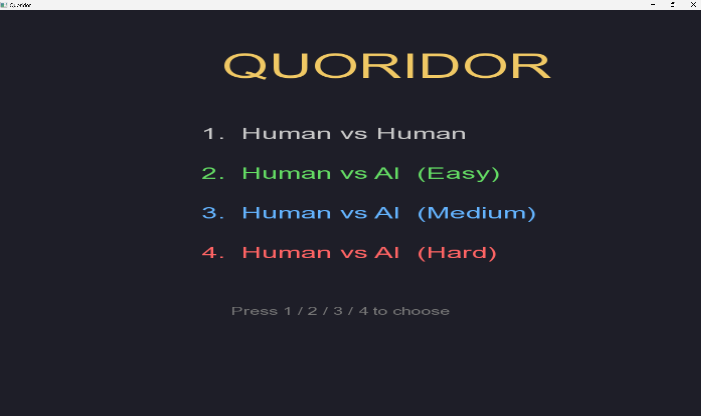
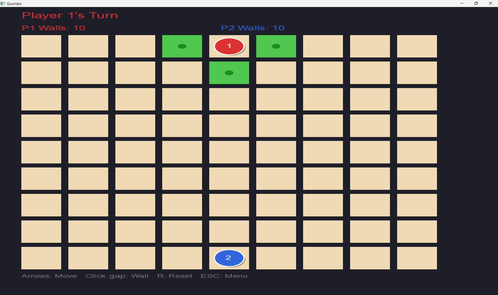
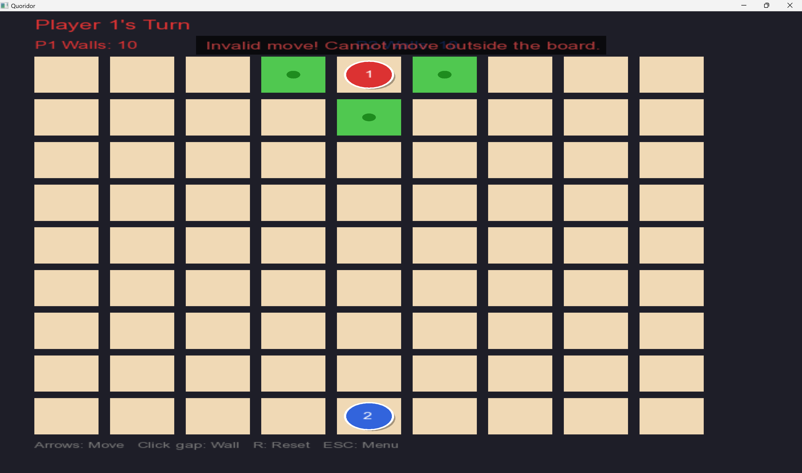
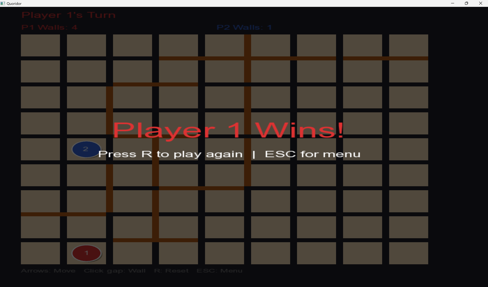

# Quoridor Game

A complete implementation of the **Quoridor** board game built in C++ with SFML 3.0, featuring a graphical interface, local multiplayer, and an AI opponent with three difficulty levels.

> 🎥 **Demo Video:** [INSERT VIDEO LINK HERE]

---

## Game Description

Quoridor is an abstract strategy board game invented by Mirko Marchesi (1997). Two players each control a pawn and take turns either moving their pawn or placing a wall. The first player to reach the opposite side of the board wins.

**Rules summary:**
- Player 1 (red) starts at the top-center and must reach the bottom row
- Player 2 (blue) starts at the bottom-center and must reach the top row
- Each player has 10 walls to place
- Pawns move one square orthogonally per turn
- If the opponent is adjacent with no wall between you, you can jump over them
- Walls block movement but cannot completely cut off any player's path to their goal

---

## Screenshots

| Main Menu | Game in Progress |
|-----------|-----------------|
|  |  |

| Valid Move Highlights | Win Screen |
|----------------------|------------|
|  |  |

> 📷 Add your screenshots to a `screenshots/` folder in the repository and update the paths above.

---

## Installation and Running Instructions

### Prerequisites
- Windows 10/11 (64-bit)
- [MSYS2](https://www.msys2.org) installed at `C:\msys64\`
- GCC and SFML installed via MSYS2

### Step 1 — Install MSYS2
Download and install from [msys2.org](https://www.msys2.org). Keep the default installation path (`C:\msys64\`).

### Step 2 — Install GCC and SFML
Open the **MSYS2 MINGW64** terminal and run:
```bash
pacman -Syu
pacman -S mingw-w64-x86_64-gcc
pacman -S mingw-w64-x86_64-sfml
```

### Step 3 — Clone the Repository
```bash
git clone [INSERT REPO LINK HERE]
cd QuoridorGame
```

### Step 4 — Copy DLLs
Copy all required DLLs to the `bin/` folder:
```bash
cp /c/msys64/mingw64/bin/*.dll bin/
```

### Step 5 — Compile
Open the **MSYS2 MINGW64** terminal, navigate to the project folder, and run:
```bash
g++ src/Board.cpp src/Player.cpp src/PathFinder.CPP src/QuoridorEngine.cpp \
    src/Renderer.cpp src/AI.cpp src/main.cpp \
    -IC:/msys64/mingw64/include -LC:/msys64/mingw64/lib \
    -lsfml-graphics -lsfml-window -lsfml-system \
    -std=c++17 -o bin/QuoridorGame.exe
```

### Step 6 — Run
```bash
cd bin
./QuoridorGame.exe
```

---

## Controls

### Menu
| Key | Action |
|-----|--------|
| `1` | Start Human vs Human |
| `2` | Start Human vs AI (Easy) |
| `3` | Start Human vs AI (Medium) |
| `4` | Start Human vs AI (Hard) |

### In-Game
| Input | Action |
|-------|--------|
| `Arrow Keys` | Move your pawn (up / down / left / right) |
| `Mouse Left Click` on a gap | Place a wall at that position |
| `R` | Reset the current game |
| `ESC` | Return to the main menu |

### Notes
- Arrow keys automatically attempt a jump if the opponent is adjacent
- Clicking on a playable square (not a gap) does nothing — walls are gap-only
- Valid moves are highlighted in **green** on your turn
- Status messages appear briefly after each action to confirm or explain errors

---

## Project Structure

```
QuoridorGame/
├── src/
│   ├── Point.h              # Core types: Point, CellType, Orientation
│   ├── Board.h / Board.cpp  # 17x17 internal grid
│   ├── Player.h / Player.cpp
│   ├── PathFinder.h / PathFinder.CPP
│   ├── QuoridorEngine.h / QuoridorEngine.cpp
│   ├── AI.h / AI.cpp        # Minimax with Alpha-Beta pruning
│   ├── Renderer.h / Renderer.cpp
│   └── main.cpp
├── bin/                     # Compiled executable + DLLs
├── screenshots/             # Screenshots for README
└── README.md
```

---

## Team Members

| Name | Student ID |
|------|-----------|
| [Student Name 1] | [ID] |
| [Student Name 2] | [ID] |
